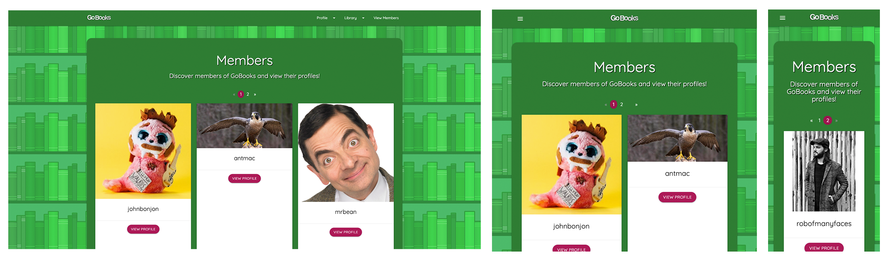
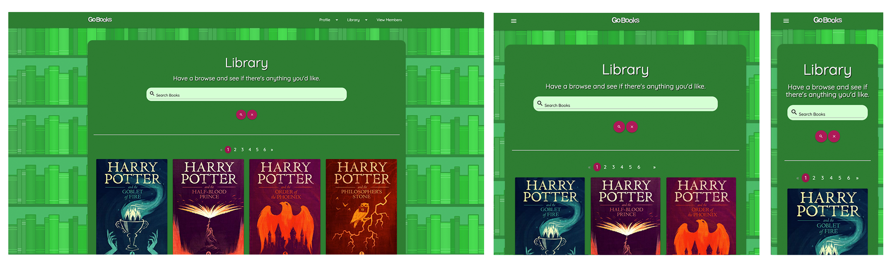

# Milestone Project 3 - GoBooks

- [GoBooks Host Link](https://gobooksproject.herokuapp.com/)
- [GoBooks GitHub Repo Link](https://github.com/Robert-Clark-1990/MS3_GoBooks)

# Table of Contents

 - [**Introduction**](#introduction)

 - [**User Experience**](#user-experience)
    - [Project Goals](#project-goals)
    - [User Stories](#user-stories)
    - [Wireframes](#wireframes)
    - [Site Design](#site-design)
    - [Database Design](#database-design)

 - [**Features**](#features)
    - [Existing Features](#existing-features)
    - [Future Features To implement](#future-features-to-implement)

 - [**Technologies Used**](#technologies-used)
    - [Languages](#languages)
    - [APIS and Frameworks](#apis-and-frameworks)
    - [Hosting, Databases and Version Control](#hosting,-databases-and-version-control)
    - [Websites](#websites)

 - [**Testing**](#testing)
    - [Bug Fixes](#bug-fixes)
    - [Performance](#performance)
    - [Validator Tests](#validator-tests)
    - [Meeting Project Needs](#meeting-project-needs)

 - [**Deployment**](#deployment)

 - [**Credits**](#credits)
    - [Content](#content)
    - [Media](#media)
    - [Code](#code)
    - [Acknowledgements](#acknowledgements)

---

# Introduction


In order to showcase an understanding of Data Centric Development, this project has been created. GoBooks utilises information stored in an external database with data that is populated
within the project website. Users utilise CRUD functionality to create profiles, books and user reviews, all within a stylish and straightforward interface. This project also uses 
secure frameworks and validation tools to deter users from manipulating the site outside of its intended capabilities.

---

# User Experience

## Project Goals
GoBooks is a web application that allows users to build a digital library, review books they have read, and discover new reads that may interest them. 
Once the user has signed up to the site, they will have the ability to build out their profile and create their own personal library of books they have read and reviewed.
This site is aimed at people of all ages, races and genders who share a common interest: a love of books, and as such the site has been specifically designed to 
encourage engagement through a user-friendly aesthetic. 


## User Stories

**As a First Time Visitor I want to:**
* Understand the purpose of the website.
* Navigate easily through the website available to non-members.
* Understand the benefits of becoming a member and locate the Register page.

**As a Member I want to:**
* Be able to write, edit and delete my own reviews.
* Locate books using the search functionality, read reviews left by members and be able to click through to the book’s Amazon page.
* Use the website’s Book Lucky Dip to find a new book to read.
* Benefit from the incentives of membership.
* View my personalised Member Profile page.
* View other members on the site and see what books they have reviewed.

**As an Admin I want to:**
* Have the ability to delete reviews that may be deemed rude or offensive.
* Have the ability to remove members who abuse the service.

**As Site Owner I want to:**
* Encourage users to become members and grow the platform.


## Wireframes


## Site Design

### Colour Scheme
GoBooks uses a simple yet effective colour palette. The use of Green illicit thoughts of harmony and health, relaxing and encouraging a positive mindset to the user.

### Typography
GoBooks uses the font [Quicksand](https://fonts.google.com/specimen/Quicksand?query=quicksand&preview.text_type=custom), sourced from **Google Fonts**. This font was chosen to work in
conjunction with the colour palette to instil a calm and comforting sense across the entire website.

### Artwork


## Database Design


---

# Features

## Existing Features
To realise the goals of the project, the following features were implemented:

### Home page 


A warm and welcoming home page was created to inspire the all-inclusive nature of the site and encourage new users to discover what GoBooks has to offer. Once the user has become a member, the 
introduction text is replaced by a search bar function and links to **Lucky Dip** and **What's Hot**.


### Log In 


Upon returning to the site to log in, users are greeted with a simplistic login page that asks for their username and password. Non-members who accidentally click on this page are invited to
register an account via the link at the bottom of the page.


### Register


Users looking to become members are given a short form asking for their details before they can become a member. Future features would offer users the option to upload an image rather than input
a web link to an image.


### Profile


Users can access their profile once they have logged in, and can view other member's profiles via the **Member List** page. Users have access to edit or delete their own profile via the dropdown menu,
and Admins can delete profiles that abuse the site. Users can view a list of the reviews the member has posted.


### Members List



Users can view the profiles of other members via the members list page, which are split into cards with their user image, username, and whether or not they are an Admin shown in the card.


### Library



Here users can view the entire contents of the library, or narrow down their search using the search bar above. Books are split into cards, with a truncated version of the book description 
visible when the card is expanded. Users can click through to read more about their book of choice, or can add a book via the link at the bottom of the page.


### Book page


Users can access individual pages for each book in the library, viewing the book description in its entirety, with links to buy the book on Amazon, or review the book if they have read it.
Users can read reviews by other members below the book description. Admins can edit or delete the book, and can edit or delete user reviews.


### Lucky Dip


The Lucky Dip page selects a book at random from the library and presents it to the user. Users can then choose to purchase the book, or select another book.


### What's Hot


The What's Hot page presents the user with the ten most recent reviews, with links to purchase the books if they so wish.


### Review Page


Users can add, edit and delete reviews for books they have read. Book information is pulled automatically, so the user only needs to type their review and leave a rating, which is converted
into stars on all pages where the review is visible.


### Add Book Page


Users can add new books to the library by filling in a form. Future features will attempt to scrape sites such as Amazon and populate book data so that users do not need to manually add this
data themselves. Admins can edit and delete books that do not contain correct data.


## Future Features To Implement

* Add functionality to connect with other members, adding each other as friends that would show on their profiles.
* Expand user profile to add books they intend to read to go along with the books they have reviewed.
* Add a storefront that will provide exclusive discounts to members who have built up their membership level.
* Add a social platform for users to host book club meetings and author events.
* A feature that was intended for this project was the implementation of affiliate links, however time overran on the project, so it was moved to a future feature. This would have taken the ASIN
or ISBN from the book entry in the library collection and paired it with an Amazon URL based on the user's geographic location, then it would have added a dedicated affiliate link to the end. 
By using the ASIN or ISBN, the result would have returned one result as these identifiers are unique to the book, which are identical regardless of geographic location. Due to the developer being
a self-published author, he has access to his own affiliate link generator, so the end result would look something like this:
   
   `{amazon_link}{ASIN/ISBN}{affiliate_link}`

   `{https://www.amazon.co.uk/dp/}{1787633616}{&linkCode=ll1&tag=robertclark08-21&linkId=d522b720d1fabb445aea2ff6829000fb}`
   

---

# Technologies Used

## Languages

* [HTML5](https://en.wikipedia.org/wiki/HTML5)

* [CSS3](https://en.wikipedia.org/wiki/CSS)

* [JavaScript](https://www.javascript.com/)

* [JQuery](https://jquery.com/)

* [Python](https://www.python.org/)

## APIS and Frameworks

* [Pip3](https://pypi.org/project/pip/)

* [Flask](https://flask.palletsprojects.com/)

* [Werkzeug](https://werkzeug.palletsprojects.com/en/1.0.x/)

* [Jinja](https://jinja.palletsprojects.com/)

* [PyMongo](https://pymongo.readthedocs.io/en/stable/)

* [DNSPython](https://www.dnspython.org/)

* [Request](https://requests.readthedocs.io/)

* [Functools](https://docs.python.org/3/library/functools.html)

* [Datetime](https://docs.python.org/3/library/datetime.html)

* [Random](https://docs.python.org/3/library/random.html)

* [OS](https://docs.python.org/3/library/os.html)

* [Bson](https://docs.mongodb.com/manual/reference/bson-types/)

## Hosting, Databases and Version Control

* [MongoDB](https://www.mongodb.com/)

* [Git](https://git-scm.com/)

* [GitHub](https://github.com/)
   
* [Heroku](https://www.heroku.com/)

## Websites

* [Materialize](https://materializecss.com/)

* [RandomKeygen](https://randomkeygen.com/)

* [Google Fonts](https://fonts.google.com/specimen/Quicksand?query=quicksand&preview.text_type=custom)

---

# Testing

## Bug Fixes

### GoBooks Logo

While implementing the new profile page, an issue arose in which the GoBooks logo wouldn't load on the page. On further investigation it appeared that this page causes issues with all loading 
concluding in a 404 error. This issue was caused because Flask was unable to load the image, so a static URL path was required. This was as simple as changing the image source from:
 ```
img src="static/images/logo_mini.png "
```
to
```
img src="{{ url_for('static', filename='/images/logo_mini.png') }}"
```


### Auto Populating Database Entry Data

In order to ensure that the database functioned as intended, three collections were made: **Members**, **Library** and **Reviews**. Despite holding much of the same data in each, the
Library and Review collections were split into two separate collections so that an admin could delete a review without removing the connected book, and vice versa. The intention was that the 
user would select the **Add Review** option from the page of the book they wished to review, which would then populate the necessary data into the database entry so that the user didn't have to. 
This would leave them needing only to review and rate the book. 

However, this developed some issues when trying to implement the necessary data into the review form. Initial attempts resulted in these entries returning Null as a response, especially when 
the user edited their review, or not updating the entry if edited or deleted. This was eventually fixed when it was discovered that the complication of book_id and review_id had been misunderstood.
After some time spent better understanding this complication, the code was updated and the function worked as intended.


### Search bar

In order to allow users to search for their favourite books, this project follows the tutorial outlined in Code Institute's mini task project. However, upon completion of the tutorial,
the search function didn't work. It would return a 200 status, and even when adding a print function, it would not print the query to the terminal. Extensive searching online could not 
return any solutions as the search bar was submitting a GET request, not a POST request.

Finally, CI tutor **Igor_CI** discovered that the form was actually nested inside another form tag, which was causing the issue. Once this outer form was deleted, the form worked exactly as intended.


### Searching With Pagination

Following the implementation of a pagination function (With credit given to **[mozillag's flask pagination](https://gist.github.com/mozillazg/69fb40067ae6d80386e10e105e6803c9)** for the flask pagination)
to split the library down into sections, a new error arose with the search bar. The pagination for the library (when no search was made) worked perfectly (albeit with an issue wherein pages would split 
into sets of 10, not the intended 12), and the user could move through paginated pages with no issues. However, as the search function required the use of an if statement to generate results, the pagination
started to malfunction. The get_results function had to be moved within the if statement as it needed to return the results of the query, but this threw up issues wherein the rendered template would be 
referencing local variables before they had been assigned.

 ```
def search():

    if request.method == "POST":
        query = request.form.get("query")
        books = list(mongo.db.library.find({"$text": {"$search": query}}))
        total = len(books)

        # Sets Pagination Pages
        def get_results(offset=0, per_page=12):
            return books[offset: offset + per_page]

        page, per_page, offset = get_page_args(page_parameter='page',
                                               per_page_parameter='per_page')
        pagination_results = get_results(offset=offset, per_page=per_page)

        pagination = Pagination(page=page, per_page=per_page, total=total)
    return render_template("library.html", books=pagination_results,
                           page=page, per_page=per_page, pagination=pagination)
 ```
Unfortunately this issue persisted for a long time. The library and search functions were rebuilt following guidance from **[DarilliGames](https://github.com/DarilliGames/flaskpaginate/blob/master/app.py#L80)**
which consolidated the get_results function into the parent function. This at least made the results per page go up to the intended 12 results (so that it would look uniform on all screen sizes)
however the issue continued.
 ```
pymongo.errors.OperationFailure: "$search" had the wrong type. Expected string, found null, full error: {'operationTime': Timestamp(1612977003, 22), 'ok': 0.0, 
'errmsg': '"$search" had the wrong type. Expected string, found null', 'code': 14, 'codeName': 'TypeMismatch', '$clusterTime': {'clusterTime': Timestamp(1612977003, 22), 
'signature': {'hash': b'\x91\x1a\x9d\xee\xc9\x0c4\x17\x01\xfb\x93\xd3Vt$\xbe\xd7\xca\xe3\xed', 'keyId': 6916065002138894339}}}
 ```
 The search would return the first page of results, but it would not recognise the page arguments for any further pages. After many long hours, this finally was resolved when the form used 
 on the library page was no longer set to POST. Al that remained was to add an if statement that would return the correct response if the user's search returned no results.


### Admin Implementation

---

### Login Decorator

Following a review by **Precious_Mentor** a security issue was highlighted that allowed non-members to access areas of the project that should be exclusive to members (such as the library).
To fix this, a Login Required Decorator was created to accompany each member-exclusive page, that was sourced from **[PalletsProjects](https://flask.palletsprojects.com/en/1.1.x/patterns/viewdecorators/#login-required-decorator)**, 
via **Igor_CI** on Slack. 
```
@app.route("/members")
@login_required
```
As you can see, the decorator sits within the app route for pages that only members of the site can access. Any attempts to break through this will be met with a redirect to the homepage and a 
flash message telling them to sign up to get access.


### Expanding Functionality Beyond Amazon

One issue that was raised by a project tester was that the add_book function only allowed inputs from Amazon, and not other pages. This was due to the inclusion of a required input of the
Amazon Serial Identifier Number (ASIN), which is only found on Amazon products. If someone wanted to add a book via a different platform, they would be unable to proceed past this point.
The reason this was initially included was to ensure that the same book could not be added twice, but if two books with the same name existed they could be included. Further research into this
showed that books have their own unique identifier, known as an ISBN (International Standard Book Number) which is unified across all physical and digital books no matter their storefront.
Therefore the database was updated to allow the inclusion of the ISBN, along with the ASIN, as this will provide the groundwork for a future feature, which will generate a sales link that
scrapes the user's location by country and searches for the ISBN or ASIN with a unique affiliate link included at the end.


### Adding Validation to Forms

Following a review by **Precious_Mentor** an issue was highlighted that allowed users to input answers to forms that should have been incorrect (such as numbers for names or whitespace for text).
To counter this, validation was added to each form to ensure that only the correct data was being inputted.
```
<div class="row">
    <div class="input-field col s10 offset-s1">
        <input id="username" name="username" type="text" pattern="^[a-zA-Z0-9]{5,20}$" class="validate"
            oninvalid="this.setCustomValidity('Please enter a username between 5 and 20 characters. Only alphanumeric characters are accepted')"
            oninput="this.setCustomValidity('')" minlength="5" maxlength="20" required>
        <label for="username">Username</label>
    </div>
</div>
```

---

## Performance

### Google Chrome Lighthouse 
[Lighthouse](https://developers.google.com/web/tools/lighthouse) was used to ensure this project ran efficiently.


## Validator Testing

### W3 HTML Validator 
The [W3C Markup Validation](https://validator.w3.org/) was used to ensure HTML met the necessary standards.


### Jigsaw CSS Validator
[Jigsaw](https://jigsaw.w3.org/css-validator/validator) was used to validate CSS code used in the project.


### JSHint JS Validator
[JS Hint](https://jshint.com/) was used to validate JavaScript code used in the project.


### PEP8 Python Validator 
[PEP8](http://pep8online.com/) was used to validated Python code used in this project.

---

## Meeting Project Needs

**As a First Time Visitor I want to:**
1. Understand the purpose of the website.
2. Navigate easily through the website available to non-members.
3. Understand the benefits of becoming a member and locate the Register page.

Through the introductory text on the homepage, the user is given an insight into the purpose of the site, and given easy access to a registration page, therefore meeting the criteria.


**As a Member I want to:**
1. Be able to write, edit and delete my own reviews.
2. Locate books using the search functionality, read reviews left by members and be able to click through to the book’s Amazon page.
3. Use the website’s Book Lucky Dip to find a new book to read.
4. Benefit from the incentives of membership.
5. View my personalised Member Profile page.
6. View other members on the site and see what books they have reviewed.

Members are given a wealth of actions available to them upon registration completion. Search functions allow them access to the library, while the Lucky Dip and What's Hot pages offer something
new and unexpected. Members can add books, and add, edit or delete reviews, and can view the reviews of other members, therefore meeting all the criteria.


**As an Admin I want to:**
1. Have the ability to delete reviews that may be deemed rude or offensive.
2. Have the ability to remove members who abuse the service.


**As Site Owner I want to:**
1. Encourage users to become members and grow the platform.

Through the implementation of various member options, the site has proved its usefulness, and will continue to expand as future features are added. Therefore the site owner criteria are met.


---

# Deployment

## Heroku Deployment

This project was deployed to Heroku via the following steps:

1. Create a requirements.txt file by inputting the following command into the terminal: `pip3 freeze --local > requirements.txt`

2. Create a Procfile by inputting the following command into the terminal: `echo web: python app.py > Procfile`

3. Log into [Heroku](https://www.heroku.com/), click **New** and **Create New App**. Give the project a unique name, choose the region and click **Create App**.

4. Select **Github** from the **Deployment Method** section, and select Automatic Deployment.

5. Select your Github user and enter the name of your repo, then select it from the search and click **Connect**.

6. From the **Settings** menu, click **Reveal Config Vars**. Set the variables for **IP**, **PORT**, **SECRET_KEY**, **MONGO_URI** and **MONGODB_NAME**, ensuring they match with those
   in the **env.py** file.

7. Click **Deploy**, select **Enable Automatic Deployment**, then select **Deploy Branch**.

8. Once Heroku has completed building the app, click **View App** to open it.


## Running this project from the repository

This project was created using **Gitpod** and pushed to **GitHub**. To deploy this page to GitHub from its GitHub repository, the following steps were taken:

1. Visit [GitHub](https://github.com/) and log in.

2. From the repositories, select **Robert-Clark-1990/MS3_GoBooks**.

3. From the GitHub repository, click on **Settings**.

4. Scroll down to the section entitled **GitHub Pages**.

5. From the dropdown menu beneath **Source**, select the **Master branch** and hit **save**.

6. This will create a link, visible just **below the GitHub Pages title**, which will take you to the deployed website.


## Running this project locally

   To clone this project into Gitpod you will need:

1. A GitHub account.

2. Access to the Chrome browser.

Then follow these steps:

1. Install the Gitpod Browser Extensions for Chrome and restart your browser.

2. Log into Gitpod and navigate to the Project GitHub repository.

3. Click the green **"Gitpod"** button at the top of the repository.

---

# Credits

### Content

- Book covers and descriptions provided by individual authors / publishers via Amazon.


### Media

- Background artwork and Project Logo created by the developer, [Robert Clark](https://github.com/Robert-Clark-1990).


### Code

- Login Required Decorator by [PalletsProjects](https://flask.palletsprojects.com/en/1.1.x/patterns/viewdecorators/#login-required-decorator)

- Flask Pagination by [DarilliGames](https://github.com/DarilliGames/flaskpaginate/blob/master/app.py#L80)

- CSS filter generator by [Barrett Sonntag](https://codepen.io/sosuke/pen/Pjoqqp)

- Truncate Descriptions thanks to [StackOverflow](https://stackoverflow.com/questions/26973570/setting-a-max-character-length-in-css)


### Acknowledgements

- Thanks to **Igor_CI** for his assistance in locating the Login Required Decorator and help with the Search Bar function.

- Thanks to all the Code Institute tutors for their help with the pagination problem.

- Thanks to **Precious Ijege** for his continued assistance as mentor.